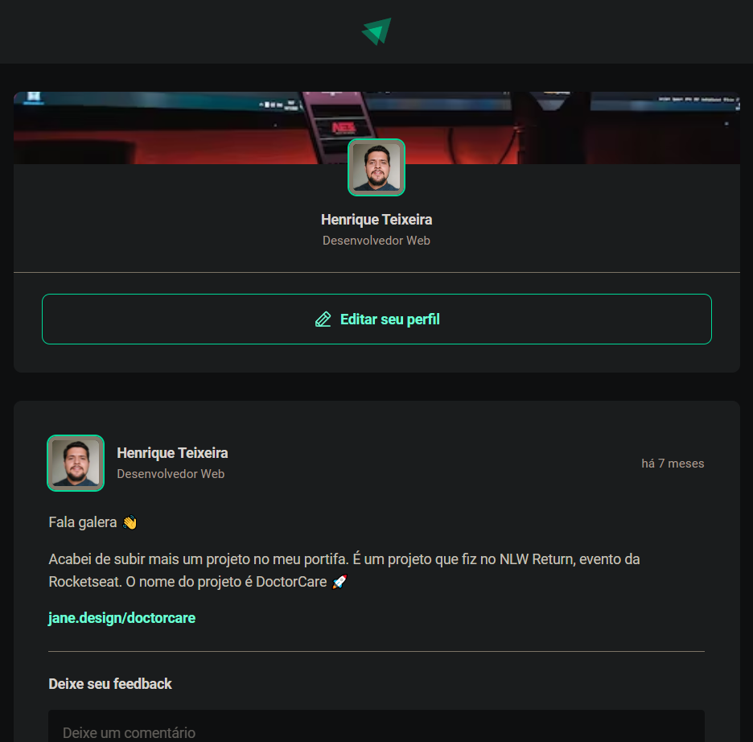

# Ignite-Feed

[Link Website](https://henrique990.github.io/Ignite-Feed/)

## Fundamentos de ReactJS
Nesse projeto, criei uma aplicação React utilizando o Vite e aprendi sobre os conceitos mais importantes do React, entre eles estão componentização, propriedades, estados, imutabilidade e hooks, além de aplicar o TypeScript no projeto e adicionar tipagem estática á aplicação.